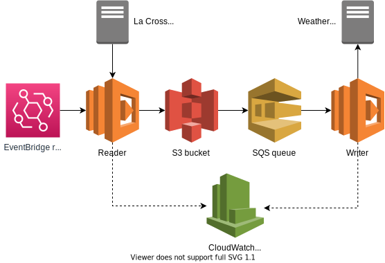

# la-crosse-to-wunderground-pws

AWS service that fetches weather observations from La Crosse Alerts Mobile and submits them to a
Weather Underground PWS.

Fits within free tier!

## Installation

```sh
nvm install # or similar
npm install
```

## Test

```sh
npm test
```

## Deploy

```sh
npm run deploy
```

## System diagram


